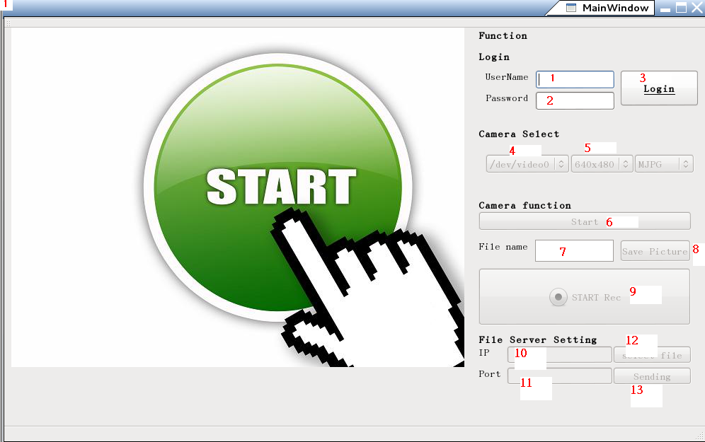
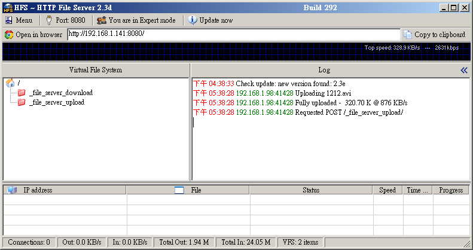
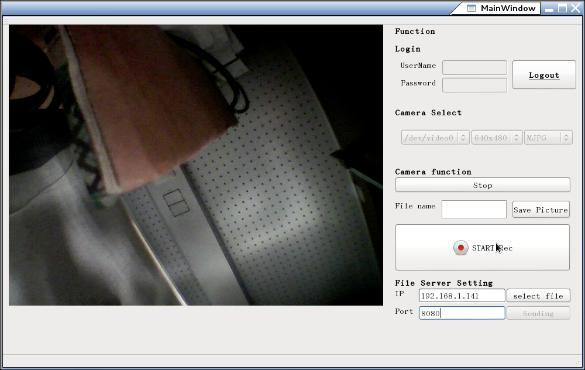

* Use v4l2 to catch camre data, ffmpeg to record video and send file to http file server.
* Based on Qt 5.3.2 (GCC 4.6.1, 64 bit)
* This application defines camera from /dev/video0 to /dev/video10.
* This application supports image size is 640x480 and 1280x720.
* It also can take picture, record, and send file to http server.
* Default username:1 , password:1

#Please follow the steps listed below.

1.  Input user name (default: 1)
2.  Input password (default: 1)
3.  Press button to login system
4.  Choose which camera  you wnat to use
5.  What size do you need
6.  Press this button to show video
7.  Type name of file you want to save picture by
8.  Press button to take picture
9.  Start/Stop record video
10. Type IP address where your http server located
11. Type port of IP address where your http server located
12. Select file you send to http server.
13. Press button to send file

## You can use http file server which is like below.

## When it is running ,it looks like below.

